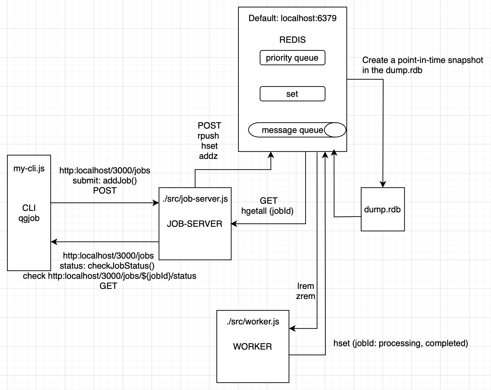

# Appwright using a custom CLI 

This is a sample project with a simple custom CLI to demonstrate how to submit and check status of jobs that test the Appwright project. This uses mobile apps from Wikipedia using the same test folder from the Appwright tests project. 

It also uses github workflows to check using the GitHub Actions Integration and runs the ```qgjob CLI``` submit tests, polls for completion of the tests and check for fails build if any test fails.
The github actions is trigger in any push command to the repo. 

## Overview

This application environment is defined in the ```package.json``` file for a custom CLI application that uses the ```job-server.js``` and ```worker.js``` for job creation and processing, Commander for command-line interface, Express for web server functionality, and Redis for queuing interactions.
The CLI application allows users to add jobs to a queue, process them, and manage job states.
The application is structured to handle job processing in a worker script, and it includes a command-line interface ```qgjob``` for user interaction.

## Dependencies 

The dependencies include:

  - ```commander```: A library for building command-line interfaces.
  - ```express```: A web framework for building web applications in Node.js.
  - ```ioredis```: A Redis client for Node.js that supports promises and is used for interacting with Redis
  - ```redis```: A Redis library to run redis-server
  - ```uuid```: A library to generate unique job IDs
  - ```body-parser```: A library to parse JSON HTTP requests
  - ```appwright```: A library to use the Appwright test framework for e2e testing of mobile apps
  - ```bullmq```: This library is installed as a dependency even though is not used. It can be used if needed.
  - ```jest```: This library is a JavaScript testing framework. It is not used either. It can be used if needed.

To install dependencies:

```sh
npm install commander express ioredis redis uuid body-parser appwright bullmq jest
```

You can also run the ```npm install``` alone command:

```sh
sudo npm install -g . --force
```

It will install all dependencies that appear in the package.json file with ```-g``` options to do it globally and the ```--force``` option to override default safety checks and force certain actions. Essentially, it tells npm to proceed with the command even if there are warnings or conflicts.

The ```package.json``` file defines the application name, version, description, main entry point, binary command, scripts, keywords, author, license, and dependencies.
The application is designed to be run from the command line, and it provides functionality for adding jobs to a queue, processing those jobs, and handling job events such as completion and errors.

The CLI command is defined as ```"qgjob"```, which can be used to interact with the application from the command line.

## Usage with Github actions

### The content of the ```./.github/workflows/ci.yml``` file executed in the Github Action

```sh
name: AppWright Test
on: [push]
jobs:
  run-tests:
    runs-on: ubuntu-latest
    steps:
      - uses: actions/checkout@v2
      - run: | 
          node --version 
          npm --version 
          sudo npm install -g . --force
          sudo apt install redis-server
          sudo service redis-server start
          sudo npm start & # Start the server in the background
          sleep 10 # Wait for the server to start
          qgjob submit --org-id=qualgent --app-version-id=xyz123 --test=tests/onboarding.spec.js
  # qgjob status --job-id=12345
  # To run server in a different environment for testing uncomment the code below 
  #   runs-on: ubuntu-latest
  #   steps:
  #     - uses: actions/checkout@v2
  #     - run: echo "Job run-server running"
  #     - run: node --version
  #     - run: npm --version
  #     - run: sudo apt install redis-server
  #     - run: sudo service redis-server start
  #     - run: sudo npm start
```
The ```sudo npm install``` command with the options will install all the dependencies and devDependencies listed in the ```package.json``` file as we mentioned above. The ```sudo apt install redis-server``` install the Redis server that listen HTTP requests in localhost:6379 by default. The ```sudo service redis-server start``` starts the service in Ubuntu. The ```sudo npm start &``` starts the job-server script and the worker script follow by 10 seconds sleep. Finally, the ```qgjob submit --org-id=qualgent --app-version-id=xyz123 --test=tests/onboarding.spec.js``` submit a job to run the Appwright test. 

### Run the tests

To run the tests on the repository directory using the Github actions you need to only push to the main branch:

```sh
git push origin main
```

The above command will activate the system and run tests on Android and iOS simulators. The examples considered are as follows:

```sh
npx appwright test --project android
npx appwright test --project ios
npx appwright test --project android-pixel-4
npx appwright test --project browserstack
npx appwright test --project web
```
These examples allow to run more configurations but in reality only two configurations (android and ios) are set in the ```appwright.config.ts``` since we are taking only the tests from the ```./tests``` folder in the example of the Appwright repository. The configuration file sets up two projects: one for iOS and one for Android. Each project specifies the platform, device, and build path for the application to be tested. The iOS project name is iPhone 14 Pro emulator, while the Android project uses an emulator without a specific device name. The build paths point to the respective application files for testing. 

## Architecture 

The architecture of this CLI is designed to be modular and extensible. It can be easily extended to include more commands or options as needed. If no command is provided, the program will display the help information. If the user runs the CLI without any command, it will show the help information. This allows users to see the available commands and options when they run the CLI without any arguments. The help information includes the version, description, and available commands with their options. This is useful for users to understand how to use the CLI and what commands are available. The job-server and worker scripts implement the server-side logic for managing jobs and processing them by workers. The Redis is used to store job details, worker information, and job queues. Entities like jobs, workers, and queues are managed using Redis data structures such as hashes, lists, and sorted sets and communication between the CLI and the server is done through HTTP requests. The server listens for incoming requests on a specified port and provides endpoints for adding jobs and checking job status. Then the server responds with the appropriate data or status information. The server can be run independently or as part of a larger application and communicates with the workers to process jobs and the Redis instance to manage job states and queues using Redis commands. The Redis instance is used to manage job states and queues, allowing workers to pick up jobs and process them based on their target platforms. It also allows for efficient job management and processing, ensuring that jobs are processed in the order of priority and that workers can handle multiple jobs concurrently. Additionally, the Redis instance creates point-in-time snapshots of job states, allowing for easy recovery and management of jobs in case of failures or restarts.

Please see the Figure below for the architecture of the CLI and its components.

 

**Figure 1:** Architecture of the Appwright CLI and its components.

## LOGs

The ```./src/logs``` folder contains two logs files for the job-server and the cli that exemplifies how to run the project and create jobs. The steps are the following:

Run a server instance

```sh
npm start
```

Run a cli instance and submit jobs

```sh
qgjob submit --org-id=qualgent --app-version-id=v1.0.0 --test=tests/tests.spec.js
```

Run a status check of the job Id, the job Id is displayed in the output of the previous command

```sh
qgjob status --job-id=<job Id>
```